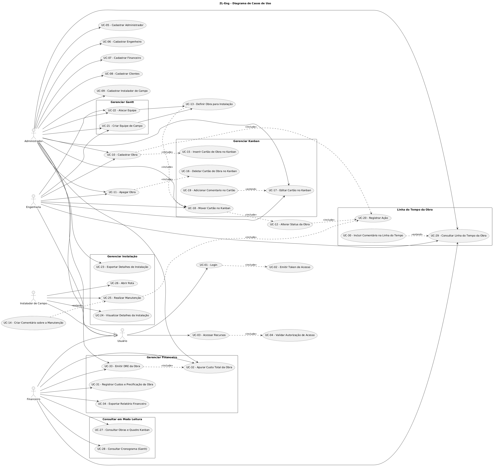

# Documento de Casos de Uso

**ZL Engenharia — Especificação de Requisitos de Software v1.1**

## Controle do Documento

| Campo | Valor |
| --- | --- |
| Versão do documento | 1.1 |
| Data | 05/10/2026 |
| Status | Vigente |
| Projeto | Projeto Integrador IV (UFC) |
| Cliente | ZL Engenharia |
| Documento anterior | - |
| Documentos relacionados | [Requisitos Funcionais e Não Funcionais](01_Requisitos_Funcionais_e_Nao_Funcionais.md) |

### Templates Utilizados

| Elemento | Template adotado |
| --- | --- |
| Estrutura do documento | ISO/IEC/IEEE 29148:2018 |
| Casos de uso | Cockburn (*Writing Effective Use Cases*) |

## 1. Atores do Sistema

| Ator | Descrição |
| --- | --- |
| Administrador | Responsável pela gestão geral do sistema, incluindo utilizadores, clientes, obras, equipas, Kanban, Gantt, informações financeiras e demais recursos administrativos. |
| Engenharia / Obras | Responsável pelo planeamento e execução das obras, incluindo gestão de obras, Kanban, equipas, alocação no Gantt e acompanhamento da linha do tempo. |
| Financeiro | Responsável pelo controle de custos e resultado das obras, incluindo consulta em modo leitura a obras, Kanban, Gantt e linha do tempo, registro e apuração de custos, emissão do DRE da obra, exportação de relatórios financeiros e inclusão de comentários na linha do tempo. |
| Instalador de Campo | Responsável pela execução e manutenção das instalações em campo, incluindo consulta às informações das instalações, abertura de rotas, realização de manutenções e inclusão de comentários de manutenção. |

## 2. Matriz de Acesso aos Casos de Uso

| Ator | UC-01 | UC-02 | UC-03 | UC-04 | UC-05 | UC-06 | UC-07 | UC-08 | UC-09 | UC-10 | UC-11 | UC-12 | UC-13 | UC-14 | UC-15 | UC-16 | UC-17 | UC-18 | UC-19 | UC-20 | UC-21 | UC-22 | UC-23 | UC-24 | UC-25 | UC-26 | UC-27 | UC-28 | UC-29 | UC-30 | UC-31 | UC-32 | UC-33 | UC-34 |
| --- | --- | --- | --- | --- | --- | --- | --- | --- | --- | --- | --- | --- | --- | --- | --- | --- | --- | --- | --- | --- | --- | --- | --- | --- | --- | --- | --- | --- | --- | --- | --- | --- | --- | --- |
| Administrador | X | X | X | X | X | X | X | X | X | X | X | | | | | | X | X | | | X | X | X | | | | | | X | | | X | X | |
| Engenharia / Obras | X | X | X | X | | | | | | X | X | | | | | | X | X | | | X | X | | | | | | | X | | | | | |
| Financeiro | X | X | X | X | | | | | | | | | | | | | | | | | | | | | | | X | X | X | X | X | X | X | X |
| Instalador de Campo | X | X | X | X | | | | | | | | | | X | | | | | | | | | | X | X | X | | | | | | | | |

## 3. Diagrama de Casos de Uso

## 4. Índice dos Casos de Uso

| ID | Caso de Uso |
| --- | --- |
| [UC-01](#uc-01) | Login |
| [UC-02](#uc-02) | Emitir Token de Acesso |
| [UC-03](#uc-03) | Acessar Recursos |
| [UC-04](#uc-04) | Validar Autorização de Acesso |
| [UC-05](#uc-05) | Cadastrar Administrador |
| [UC-06](#uc-06) | Cadastrar Engenheiro |
| [UC-07](#uc-07) | Cadastrar Financeiro |
| [UC-08](#uc-08) | Cadastrar Clientes |
| [UC-09](#uc-09) | Cadastrar Instalador de Campo |
| [UC-10](#uc-10) | Cadastrar Obra |
| [UC-11](#uc-11) | Apagar Obra |
| [UC-12](#uc-12) | Alterar Status da Obra |
| [UC-13](#uc-13) | Definir Obra para Instalação |
| [UC-14](#uc-14) | Criar Comentário sobre a Manutenção |
| [UC-15](#uc-15) | Inserir Cartão de Obra no Kanban |
| [UC-16](#uc-16) | Deletar Cartão de Obra no Kanban |
| [UC-17](#uc-17) | Editar Cartão no Kanban |
| [UC-18](#uc-18) | Mover Cartão no Kanban |
| [UC-19](#uc-19) | Adicionar Comentario no Cartão |
| [UC-20](#uc-20) | Registrar Ação |
| [UC-21](#uc-21) | Criar Equipe de Campo |
| [UC-22](#uc-22) | Alocar Equipe |
| [UC-23](#uc-23) | Exportar Detalhes de Instalação |
| [UC-24](#uc-24) | Visualizar Detalhes da Instalação |
| [UC-25](#uc-25) | Realizar Manutenção |
| [UC-26](#uc-26) | Abrir Rota |
| [UC-27](#uc-27) | Consultar Obras e Quadro Kanban |
| [UC-28](#uc-28) | Consultar Cronograma (Gantt) |
| [UC-29](#uc-29) | Consultar Linha do Tempo da Obra |
| [UC-30](#uc-30) | Incluir Comentário na Linha do Tempo |
| [UC-31](#uc-31) | Registrar Custos e Precificação da Obra |
| [UC-32](#uc-32) | Apurar Custo Total da Obra |
| [UC-33](#uc-33) | Emitir DRE da Obra |
| [UC-34](#uc-34) | Exportar Relatório Financeiro |

## 5. Casos de Uso (Textual)

### UC-01 - Login

**Descrição:** Permite que um usuário se autentique no sistema informando suas credenciais.

**Atores:** Usuário (Administrador, Engenharia, Financeiro, Instalador de Campo)

**Pré-condição:** O usuário está cadastrado e ativo no sistema.

**Fluxo principal:**

1. O usuário acessa a tela de login.
2. O usuário informa e-mail e senha.
3. O sistema valida as credenciais.
4. O sistema executa o [UC-02](#uc-02) (Emitir Token de Acesso).
5. O sistema redireciona o usuário para a tela inicial conforme seu perfil.

**Fluxos alternativos:**

- FA1 - Credenciais inválidas (passo 3): o sistema exibe mensagem de erro e retorna ao passo 2.
- FA2 - Usuário inativo (passo 3): o sistema informa que o acesso está desativado e encerra o fluxo.
- FA3 - Tentativas excedidas (passo 3): o sistema bloqueia temporariamente novas tentativas e encerra o fluxo.

**Pós-condição:** O usuário está autenticado e possui um token de acesso válido.

**Regras de negócio:**

- RN1 - A senha deve ser armazenada de forma criptografada (hash).
- RN2 - Após 5 tentativas inválidas consecutivas, o login é bloqueado temporariamente.
- RN3 - A mensagem de erro não deve indicar qual credencial está incorreta.

**Prioridade:** Alta

**RF relacionado:** [RF-01](01_Requisitos_Funcionais_e_Nao_Funcionais.md#rf-01), [RF-19](01_Requisitos_Funcionais_e_Nao_Funcionais.md#rf-19)

---

### UC-02 - Emitir Token de Acesso

**Descrição:** Gera o token que identifica o usuário autenticado e seu perfil nas requisições seguintes.

**Atores:** Sistema (incluído pelo [UC-01](#uc-01))

**Pré-condição:** As credenciais do usuário foram validadas com sucesso.

**Fluxo principal:**

1. O sistema recebe a identificação do usuário autenticado.
2. O sistema gera o token contendo identificador, perfil e data de expiração.
3. O sistema assina o token.
4. O sistema retorna o token ao cliente.

**Fluxos alternativos:**

- FA1 - Falha na geração (passo 2): o sistema registra o erro, informa falha temporária e o login não é concluído.

**Pós-condição:** Um token válido e com prazo de expiração foi emitido para o usuário.

**Regras de negócio:**

- RN1 - O token deve ter tempo de expiração definido.
- RN2 - O token deve conter o perfil do usuário para uso na autorização.

**Prioridade:** Alta

**RF relacionado:** [RF-01](01_Requisitos_Funcionais_e_Nao_Funcionais.md#rf-01)

---

### UC-03 - Acessar Recursos

**Descrição:** Permite que o usuário autenticado acesse as funcionalidades e dados do sistema permitidos ao seu perfil.

**Atores:** Usuário (Administrador, Engenharia, Financeiro, Instalador de Campo)

**Pré-condição:** O usuário está autenticado e possui um token válido.

**Fluxo principal:**

1. O usuário solicita um recurso do sistema.
2. O sistema executa o [UC-04](#uc-04) (Validar Autorização de Acesso).
3. O sistema libera o recurso solicitado.
4. O sistema exibe o recurso ao usuário.

**Fluxos alternativos:**

- FA1 - Token expirado (passo 2): o sistema encerra a sessão e redireciona o usuário para o [UC-01](#uc-01).
- FA2 - Perfil sem permissão (passo 2): o sistema nega o acesso e exibe mensagem de acesso não autorizado.

**Pós-condição:** O recurso é exibido ao usuário ou o acesso é negado.

**Regras de negócio:**

- RN1 - O acesso a cada recurso depende do perfil do usuário.
- RN2 - Toda requisição deve ser acompanhada de token válido.

**Prioridade:** Alta

**RF relacionado:** [RF-02](01_Requisitos_Funcionais_e_Nao_Funcionais.md#rf-02), [RF-19](01_Requisitos_Funcionais_e_Nao_Funcionais.md#rf-19)

---

### UC-04 - Validar Autorização de Acesso

**Descrição:** Verifica se o token apresentado é válido e se o perfil do usuário tem permissão para o recurso solicitado.

**Atores:** Sistema (incluído pelo [UC-03](#uc-03))

**Pré-condição:** Existe uma requisição de acesso a um recurso protegido.

**Fluxo principal:**

1. O sistema extrai o token da requisição.
2. O sistema verifica a assinatura e a validade do token.
3. O sistema identifica o perfil do usuário.
4. O sistema compara o perfil com as permissões exigidas pelo recurso.
5. O sistema autoriza o acesso.

**Fluxos alternativos:**

- FA1 - Token ausente ou inválido (passo 2): o sistema nega o acesso com resposta de não autenticado.
- FA2 - Token expirado (passo 2): o sistema nega o acesso e solicita novo login.
- FA3 - Perfil sem permissão (passo 4): o sistema nega o acesso com resposta de proibido.

**Pós-condição:** O acesso é autorizado ou negado conforme a validação.

**Regras de negócio:**

- RN1 - Cada recurso deve ter a lista de perfis autorizados definida.
- RN2 - Tentativas de acesso negadas devem ser registradas.

**Prioridade:** Alta

**RF relacionado:** [RF-02](01_Requisitos_Funcionais_e_Nao_Funcionais.md#rf-02)

---

### UC-05 - Cadastrar Administrador

**Descrição:** Permite cadastrar um novo usuário com perfil Administrador.

**Atores:** Administrador

**Pré-condição:** O usuário está autenticado com perfil Administrador.

**Fluxo principal:**

1. O Administrador acessa a tela de cadastro de usuários.
2. O Administrador informa nome, e-mail e senha inicial.
3. O Administrador confirma o cadastro.
4. O sistema valida os dados.
5. O sistema salva o novo administrador com status ativo.
6. O sistema exibe mensagem de sucesso.

**Fluxos alternativos:**

- FA1 - E-mail já cadastrado (passo 4): o sistema informa a duplicidade e retorna ao passo 2.
- FA2 - Dados obrigatórios ausentes ou inválidos (passo 4): o sistema destaca os campos e retorna ao passo 2.
- FA3 - Cancelamento (qualquer passo): o sistema descarta os dados e retorna à lista de usuários.

**Pós-condição:** Um novo usuário Administrador está cadastrado e ativo.

**Regras de negócio:**

- RN1 - Somente Administradores podem cadastrar outros Administradores.
- RN2 - O e-mail deve ser único no sistema.
- RN3 - A senha inicial deve atender à política mínima de segurança.

**Prioridade:** Alta

**RF relacionado:** [RF-01](01_Requisitos_Funcionais_e_Nao_Funcionais.md#rf-01)

---

### UC-06 - Cadastrar Engenheiro

**Descrição:** Permite cadastrar um novo usuário com perfil Engenharia.

**Atores:** Administrador

**Pré-condição:** O usuário está autenticado com perfil Administrador.

**Fluxo principal:**

1. O Administrador acessa a tela de cadastro de usuários.
2. O Administrador seleciona o perfil Engenharia.
3. O Administrador informa nome, e-mail e senha inicial.
4. O Administrador confirma o cadastro.
5. O sistema valida os dados.
6. O sistema salva o novo usuário com status ativo.
7. O sistema exibe mensagem de sucesso.

**Fluxos alternativos:**

- FA1 - E-mail já cadastrado (passo 5): o sistema informa a duplicidade e retorna ao passo 3.
- FA2 - Dados obrigatórios ausentes ou inválidos (passo 5): o sistema destaca os campos e retorna ao passo 3.
- FA3 - Cancelamento (qualquer passo): o sistema descarta os dados e retorna à lista de usuários.

**Pós-condição:** Um novo usuário com perfil Engenharia está cadastrado e ativo.

**Regras de negócio:**

- RN1 - Somente Administradores podem cadastrar usuários de Engenharia.
- RN2 - O e-mail deve ser único no sistema.

**Prioridade:** Alta

**RF relacionado:** [RF-01](01_Requisitos_Funcionais_e_Nao_Funcionais.md#rf-01)

---

### UC-07 - Cadastrar Financeiro

**Descrição:** Permite cadastrar um novo usuário com perfil Financeiro.

**Atores:** Administrador

**Pré-condição:** O usuário está autenticado com perfil Administrador.

**Fluxo principal:**

1. O Administrador acessa a tela de cadastro de usuários.
2. O Administrador seleciona o perfil Financeiro.
3. O Administrador informa nome, e-mail e senha inicial.
4. O Administrador confirma o cadastro.
5. O sistema valida os dados.
6. O sistema salva o novo usuário com status ativo.
7. O sistema exibe mensagem de sucesso.

**Fluxos alternativos:**

- FA1 - E-mail já cadastrado (passo 5): o sistema informa a duplicidade e retorna ao passo 3.
- FA2 - Dados obrigatórios ausentes ou inválidos (passo 5): o sistema destaca os campos e retorna ao passo 3.
- FA3 - Cancelamento (qualquer passo): o sistema descarta os dados e retorna à lista de usuários.

**Pós-condição:** Um novo usuário com perfil Financeiro está cadastrado e ativo.

**Regras de negócio:**

- RN1 - Somente Administradores podem cadastrar usuários do Financeiro.
- RN2 - O e-mail deve ser único no sistema.

**Prioridade:** Alta

**RF relacionado:** [RF-01](01_Requisitos_Funcionais_e_Nao_Funcionais.md#rf-01)

---

### UC-08 - Cadastrar Clientes

**Descrição:** Permite cadastrar os clientes da empresa, que serão vinculados às obras.

**Atores:** Administrador

**Pré-condição:** O usuário está autenticado com perfil Administrador.

**Fluxo principal:**

1. O Administrador acessa a tela de cadastro de clientes.
2. O Administrador informa nome, CPF/CNPJ, telefone, e-mail e endereço.
3. O Administrador confirma o cadastro.
4. O sistema valida os dados.
5. O sistema salva o cliente.
6. O sistema exibe mensagem de sucesso.

**Fluxos alternativos:**

- FA1 - CPF/CNPJ inválido (passo 4): o sistema informa o erro e retorna ao passo 2.
- FA2 - Cliente já cadastrado (passo 4): o sistema informa a duplicidade e oferece abrir o cadastro existente.
- FA3 - Cancelamento (qualquer passo): o sistema descarta os dados e retorna à lista de clientes.

**Pós-condição:** O cliente está cadastrado e disponível para vinculação a obras.

**Regras de negócio:**

- RN1 - O CPF/CNPJ deve ser válido e único.
- RN2 - Nome e CPF/CNPJ são obrigatórios.

**Prioridade:** Alta

**RF relacionado:** [RF-03](01_Requisitos_Funcionais_e_Nao_Funcionais.md#rf-03)

---

### UC-09 - Cadastrar Instalador de Campo

**Descrição:** Permite cadastrar um usuário com perfil Instalador de Campo, que consulta instalações e executa manutenções.

**Atores:** Administrador

**Pré-condição:** O usuário está autenticado com perfil Administrador.

**Fluxo principal:**

1. O Administrador acessa a tela de cadastro de usuários.
2. O Administrador seleciona o perfil Instalador de Campo.
3. O Administrador informa nome, e-mail, telefone e senha inicial.
4. O Administrador confirma o cadastro.
5. O sistema valida os dados.
6. O sistema salva o instalador com status ativo.
7. O sistema exibe mensagem de sucesso.

**Fluxos alternativos:**

- FA1 - E-mail já cadastrado (passo 5): o sistema informa a duplicidade e retorna ao passo 3.
- FA2 - Dados obrigatórios ausentes ou inválidos (passo 5): o sistema destaca os campos e retorna ao passo 3.
- FA3 - Cancelamento (qualquer passo): o sistema descarta os dados e retorna à lista de usuários.

**Pós-condição:** O Instalador de Campo está cadastrado e pode ser incluído em equipes de campo.

**Regras de negócio:**

- RN1 - Somente Administradores podem cadastrar Instaladores de Campo.
- RN2 - O Instalador de Campo possui acesso somente de leitura às informações da instalação, além do registro de manutenção.

**Prioridade:** Média

**RF relacionado:** [RF-01](01_Requisitos_Funcionais_e_Nao_Funcionais.md#rf-01)

---

### UC-10 - Cadastrar Obra

**Descrição:** Permite cadastrar uma nova obra de instalação, criando automaticamente seu cartão no Kanban e registrando a ação na linha do tempo.

**Atores:** Administrador, Engenharia

**Pré-condição:** O usuário está autenticado e o cliente da obra já está cadastrado.

**Fluxo principal:**

1. O usuário acessa a tela de cadastro de obras.
2. O usuário seleciona o cliente.
3. O usuário informa endereço da obra, descrição e demais dados do projeto.
4. O usuário confirma o cadastro.
5. O sistema valida os dados.
6. O sistema salva a obra com o status inicial.
7. O sistema executa o [UC-15](#uc-15) (Inserir Cartão de Obra no Kanban).
8. O sistema executa o [UC-20](#uc-20) (Registrar Ação).
9. O sistema exibe mensagem de sucesso.

**Fluxos alternativos:**

- FA1 - Cliente não cadastrado (passo 2): o usuário pode acionar o [UC-08](#uc-08) e retornar ao passo 2.
- FA2 - Dados obrigatórios ausentes (passo 5): o sistema destaca os campos e retorna ao passo 3.
- FA3 - Cancelamento (qualquer passo): o sistema descarta os dados e retorna à lista de obras.

**Pós-condição:** A obra está cadastrada, com cartão na primeira coluna do Kanban e ação registrada na linha do tempo.

**Regras de negócio:**

- RN1 - Toda obra deve estar vinculada a um cliente.
- RN2 - Toda obra nasce com o status inicial do fluxo.
- RN3 - Todo cadastro de obra deve gerar um cartão no Kanban e um registro na linha do tempo.

**Prioridade:** Alta

**RF relacionado:** [RF-03](01_Requisitos_Funcionais_e_Nao_Funcionais.md#rf-03)

---

### UC-11 - Apagar Obra

**Descrição:** Permite remover uma obra do sistema, excluindo também seu cartão no Kanban.

**Atores:** Administrador, Engenharia

**Pré-condição:** O usuário está autenticado e a obra existe.

**Fluxo principal:**

1. O usuário seleciona a obra.
2. O usuário solicita a exclusão.
3. O sistema exibe a confirmação da exclusão.
4. O usuário confirma.
5. O sistema executa o [UC-16](#uc-16) (Deletar Cartão de Obra no Kanban).
6. O sistema remove a obra.
7. O sistema exibe mensagem de sucesso.

**Fluxos alternativos:**

- FA1 - Cancelamento (passo 4): o sistema mantém a obra e retorna à tela anterior.
- FA2 - Obra em instalação ou com equipe alocada (passo 3): o sistema bloqueia a exclusão e informa o motivo.

**Pós-condição:** A obra e seu cartão foram removidos.

**Regras de negócio:**

- RN1 - A exclusão exige confirmação explícita do usuário.
- RN2 - Obras em execução não podem ser apagadas.
- RN3 - A exclusão deve ser lógica, preservando o histórico para auditoria.

**Prioridade:** Média

**RF relacionado:** [RF-03](01_Requisitos_Funcionais_e_Nao_Funcionais.md#rf-03)

---

### UC-12 - Alterar Status da Obra

**Descrição:** Atualiza o status da obra quando seu cartão é movido no Kanban e registra a mudança na linha do tempo.

**Atores:** Sistema (incluído pelo [UC-18](#uc-18))

**Pré-condição:** A obra existe e o cartão foi movido para uma nova coluna.

**Fluxo principal:**

1. O sistema recebe a obra e o novo status.
2. O sistema valida a transição de status.
3. O sistema atualiza o status da obra.
4. O sistema executa o [UC-20](#uc-20) (Registrar Ação).

**Fluxos alternativos:**

- FA1 - Transição inválida (passo 2): o sistema rejeita a alteração, mantém o status e informa o motivo.

**Pós-condição:** O status da obra está atualizado e a mudança foi registrada na linha do tempo.

**Regras de negócio:**

- RN1 - Os status seguem o fluxo da obra: pagamento, compra/chegada de material, programação e execução da instalação.
- RN2 - Toda mudança de status deve ser registrada com usuário, data e hora.

**Prioridade:** Alta

**RF relacionado:** [RF-04](01_Requisitos_Funcionais_e_Nao_Funcionais.md#rf-04), [RF-10](01_Requisitos_Funcionais_e_Nao_Funcionais.md#rf-10)

---

### UC-13 - Definir Obra para Instalação

**Descrição:** Marca uma obra como pronta para instalação, associando-a a uma equipe de campo e movendo seu cartão no Kanban.

**Atores:** Administrador, Engenharia

**Pré-condição:** O usuário está autenticado, a obra está apta para instalação e existe uma equipe de campo criada ou alocada.

**Fluxo principal:**

1. O usuário seleciona a obra.
2. O usuário associa a equipe de campo e o período da instalação.
3. O usuário confirma a definição.
4. O sistema valida as informações.
5. O sistema executa o [UC-18](#uc-18) (Mover Cartão no Kanban) para a coluna de instalação.
6. O sistema exibe mensagem de sucesso.

**Fluxos alternativos:**

- FA1 - Obra não apta (passo 4): o sistema informa a etapa pendente (ex.: material ou pagamento) e cancela o fluxo.
- FA2 - Conflito de agenda da equipe (passo 4): o sistema informa o conflito e retorna ao passo 2.

**Pós-condição:** A obra está definida para instalação e seu cartão foi movido para a coluna correspondente.

**Regras de negócio:**

- RN1 - A obra só pode ser definida para instalação após as etapas anteriores do fluxo.
- RN2 - Uma equipe não pode ter duas obras no mesmo período.

**Prioridade:** Alta

**RF relacionado:** [RF-07](01_Requisitos_Funcionais_e_Nao_Funcionais.md#rf-07), [RF-10](01_Requisitos_Funcionais_e_Nao_Funcionais.md#rf-10)

---

### UC-14 - Criar Comentário sobre a Manutenção

**Descrição:** Permite ao instalador adicionar um comentário opcional a uma manutenção em andamento.

**Atores:** Instalador de Campo

**Pré-condição:** O usuário está autenticado e há uma manutenção em andamento ([UC-25](#uc-25)).

**Fluxo principal:**

1. Durante a manutenção, o instalador escolhe adicionar um comentário.
2. O instalador digita o texto do comentário.
3. O instalador confirma.
4. O sistema valida o texto.
5. O sistema salva o comentário vinculado à manutenção.
6. O sistema exibe o comentário na manutenção.

**Fluxos alternativos:**

- FA1 - Comentário vazio (passo 4): o sistema informa que o texto é obrigatório e retorna ao passo 2.
- FA2 - Cancelamento (passo 3): o sistema descarta o texto e retorna à manutenção.

**Pós-condição:** O comentário está salvo e vinculado à manutenção.

**Regras de negócio:**

- RN1 - O comentário é opcional e estende o [UC-25](#uc-25) (Realizar Manutenção).
- RN2 - O comentário deve guardar autor, data e hora.

**Prioridade:** Média

**RF relacionado:** [RF-05](01_Requisitos_Funcionais_e_Nao_Funcionais.md#rf-05), [RF-19](01_Requisitos_Funcionais_e_Nao_Funcionais.md#rf-19)

---

### UC-15 - Inserir Cartão de Obra no Kanban

**Descrição:** Cria o cartão da obra no quadro Kanban.

**Atores:** Sistema (incluído pelo [UC-10](#uc-10))

**Pré-condição:** A obra foi cadastrada.

**Fluxo principal:**

1. O sistema recebe os dados da obra cadastrada.
2. O sistema cria o cartão com os dados resumidos da obra.
3. O sistema posiciona o cartão na primeira coluna do quadro.
4. O sistema exibe o cartão no Kanban.

**Fluxos alternativos:**

- FA1 - Falha na criação do cartão (passo 2): o sistema registra o erro e permite recriar o cartão posteriormente.

**Pós-condição:** O cartão da obra está visível na primeira coluna do Kanban.

**Regras de negócio:**

- RN1 - Cada obra possui um único cartão no Kanban.
- RN2 - O cartão é criado na coluna correspondente ao status inicial.

**Prioridade:** Alta

**RF relacionado:** [RF-03](01_Requisitos_Funcionais_e_Nao_Funcionais.md#rf-03), [RF-04](01_Requisitos_Funcionais_e_Nao_Funcionais.md#rf-04)

---

### UC-16 - Deletar Cartão de Obra no Kanban

**Descrição:** Remove do quadro Kanban o cartão de uma obra apagada.

**Atores:** Sistema (incluído pelo [UC-11](#uc-11))

**Pré-condição:** A exclusão da obra foi confirmada.

**Fluxo principal:**

1. O sistema localiza o cartão da obra.
2. O sistema remove o cartão da coluna.
3. O sistema atualiza o quadro.

**Fluxos alternativos:**

- FA1 - Cartão não encontrado (passo 1): o sistema registra a ocorrência e prossegue com a exclusão da obra.

**Pós-condição:** O cartão não aparece mais no Kanban.

**Regras de negócio:**

- RN1 - O cartão só pode ser removido junto com a exclusão da obra.

**Prioridade:** Média

**RF relacionado:** [RF-03](01_Requisitos_Funcionais_e_Nao_Funcionais.md#rf-03), [RF-04](01_Requisitos_Funcionais_e_Nao_Funcionais.md#rf-04)

---

### UC-17 - Editar Cartão no Kanban

**Descrição:** Permite alterar as informações de um cartão de obra no Kanban.

**Atores:** Administrador, Engenharia

**Pré-condição:** O usuário está autenticado e o cartão existe.

**Fluxo principal:**

1. O usuário abre o cartão.
2. O usuário altera os campos editáveis (título, descrição, responsável e datas).
3. O usuário salva as alterações.
4. O sistema valida os dados.
5. O sistema atualiza o cartão.
6. O sistema exibe o cartão atualizado.

**Fluxos alternativos:**

- FA1 - Dados inválidos (passo 4): o sistema destaca os campos e retorna ao passo 2.
- FA2 - Cartão alterado por outro usuário (passo 4): o sistema informa o conflito e recarrega os dados atuais.
- FA3 - Adicionar comentário (passo 2): o usuário pode acionar o [UC-19](#uc-19).
- FA4 - Cancelamento (passo 3): o sistema descarta as alterações.

**Pós-condição:** O cartão está atualizado com as novas informações.

**Regras de negócio:**

- RN1 - A mudança de coluna/status só pode ser feita pelo [UC-18](#uc-18).
- RN2 - Somente Administrador e Engenharia podem editar cartões.

**Prioridade:** Média

**RF relacionado:** [RF-04](01_Requisitos_Funcionais_e_Nao_Funcionais.md#rf-04), [RF-06](01_Requisitos_Funcionais_e_Nao_Funcionais.md#rf-06)

---

### UC-18 - Mover Cartão no Kanban

**Descrição:** Permite mover o cartão de uma obra entre as colunas do Kanban, atualizando o status da obra.

**Atores:** Administrador, Engenharia

**Pré-condição:** O usuário está autenticado e o cartão existe.

**Fluxo principal:**

1. O usuário arrasta o cartão para outra coluna.
2. O sistema valida o movimento.
3. O sistema executa o [UC-12](#uc-12) (Alterar Status da Obra).
4. O sistema atualiza a posição do cartão.
5. O sistema exibe o quadro atualizado.

**Fluxos alternativos:**

- FA1 - Movimento não permitido (passo 2): o sistema devolve o cartão à coluna de origem e informa o motivo.
- FA2 - Falha ao atualizar o status (passo 3): o sistema devolve o cartão à coluna de origem e informa o erro.

**Pós-condição:** O cartão está na nova coluna e o status da obra foi atualizado.

**Regras de negócio:**

- RN1 - O movimento deve respeitar a ordem do fluxo da obra.
- RN2 - Todo movimento altera o status da obra e é registrado na linha do tempo.

**Prioridade:** Alta

**RF relacionado:** [RF-04](01_Requisitos_Funcionais_e_Nao_Funcionais.md#rf-04), [RF-10](01_Requisitos_Funcionais_e_Nao_Funcionais.md#rf-10)

---

### UC-19 - Adicionar Comentario no Cartão

**Descrição:** Permite adicionar um comentário a um cartão durante sua edição.

**Atores:** Administrador, Engenharia

**Pré-condição:** O usuário está autenticado e está editando um cartão ([UC-17](#uc-17)).

**Fluxo principal:**

1. Durante a edição do cartão, o usuário escolhe adicionar um comentário.
2. O usuário digita o texto.
3. O usuário confirma.
4. O sistema valida o texto.
5. O sistema salva o comentário no cartão.
6. O sistema exibe o comentário no histórico do cartão.

**Fluxos alternativos:**

- FA1 - Comentário vazio (passo 4): o sistema informa que o texto é obrigatório e retorna ao passo 2.
- FA2 - Cancelamento (passo 3): o sistema descarta o texto.

**Pós-condição:** O comentário está salvo no cartão.

**Regras de negócio:**

- RN1 - O comentário é opcional e estende o [UC-17](#uc-17) (Editar Cartão no Kanban).
- RN2 - O comentário deve guardar autor, data e hora.

**Prioridade:** Baixa

**RF relacionado:** [RF-04](01_Requisitos_Funcionais_e_Nao_Funcionais.md#rf-04), [RF-11](01_Requisitos_Funcionais_e_Nao_Funcionais.md#rf-11)

---

### UC-20 - Registrar Ação

**Descrição:** Registra na linha do tempo da obra as ações relevantes realizadas no sistema.

**Atores:** Sistema (incluído pelos [UC-10](#uc-10), [UC-12](#uc-12) e [UC-25](#uc-25))

**Pré-condição:** Uma ação relevante sobre uma obra foi executada.

**Fluxo principal:**

1. O sistema recebe o evento com tipo da ação, obra, usuário e detalhes.
2. O sistema adiciona data e hora ao evento.
3. O sistema grava o registro na linha do tempo da obra.

**Fluxos alternativos:**

- FA1 - Falha na gravação (passo 3): o sistema registra o erro em log técnico para análise.

**Pós-condição:** A ação está registrada na linha do tempo da obra.

**Regras de negócio:**

- RN1 - Os registros não podem ser editados nem removidos.
- RN2 - A linha do tempo é exibida em ordem cronológica.
- RN3 - Cada registro deve identificar o usuário responsável.

**Prioridade:** Alta

**RF relacionado:** [RF-03](01_Requisitos_Funcionais_e_Nao_Funcionais.md#rf-03), [RF-04](01_Requisitos_Funcionais_e_Nao_Funcionais.md#rf-04), [RF-05](01_Requisitos_Funcionais_e_Nao_Funcionais.md#rf-05), [RF-11](01_Requisitos_Funcionais_e_Nao_Funcionais.md#rf-11), [RF-12](01_Requisitos_Funcionais_e_Nao_Funcionais.md#rf-12)

---

### UC-21 - Criar Equipe de Campo

**Descrição:** Permite montar uma equipe de campo com instaladores para execução das obras.

**Atores:** Administrador, Engenharia

**Pré-condição:** O usuário está autenticado e existem Instaladores de Campo cadastrados.

**Fluxo principal:**

1. O usuário acessa o Gantt e escolhe criar equipe.
2. O usuário informa o nome da equipe.
3. O usuário seleciona os instaladores e define o responsável.
4. O usuário confirma a criação.
5. O sistema valida os dados.
6. O sistema salva a equipe.
7. O sistema oferece executar o [UC-13](#uc-13) (Definir Obra para Instalação).

**Fluxos alternativos:**

- FA1 - Instalador já alocado no mesmo período (passo 5): o sistema informa o conflito e retorna ao passo 3.
- FA2 - Nenhum instalador selecionado (passo 5): o sistema informa que é necessário ao menos um e retorna ao passo 3.
- FA3 - Definir obra agora (passo 7): o usuário aciona o [UC-13](#uc-13).

**Pós-condição:** A equipe de campo está criada e disponível para alocação.

**Regras de negócio:**

- RN1 - Toda equipe deve ter ao menos um instalador e um responsável.
- RN2 - Um instalador não pode estar em duas equipes no mesmo período.

**Prioridade:** Alta

**RF relacionado:** [RF-07](01_Requisitos_Funcionais_e_Nao_Funcionais.md#rf-07)

---

### UC-22 - Alocar Equipe

**Descrição:** Permite alocar uma equipe de campo a uma obra em um período no Gantt.

**Atores:** Administrador, Engenharia

**Pré-condição:** O usuário está autenticado, a equipe existe e há obra aguardando instalação.

**Fluxo principal:**

1. O usuário acessa o Gantt.
2. O usuário seleciona a obra, a equipe e o período.
3. O usuário confirma a alocação.
4. O sistema verifica a disponibilidade da equipe.
5. O sistema salva a alocação.
6. O sistema executa o [UC-13](#uc-13) (Definir Obra para Instalação).
7. O sistema exibe a alocação no Gantt.

**Fluxos alternativos:**

- FA1 - Conflito de agenda (passo 4): o sistema informa o conflito e retorna ao passo 2.
- FA2 - Obra não apta para instalação (passo 4): o sistema informa a etapa pendente e cancela a alocação.

**Pós-condição:** A equipe está alocada à obra no período definido e visível no Gantt.

**Regras de negócio:**

- RN1 - Uma equipe não pode ser alocada a duas obras no mesmo período.
- RN2 - A alocação só é permitida para obras aptas à instalação.

**Prioridade:** Alta

**RF relacionado:** [RF-07](01_Requisitos_Funcionais_e_Nao_Funcionais.md#rf-07), [RF-08](01_Requisitos_Funcionais_e_Nao_Funcionais.md#rf-08), [RF-09](01_Requisitos_Funcionais_e_Nao_Funcionais.md#rf-09)

---

### UC-23 - Exportar Detalhes de Instalação

**Descrição:** Permite exportar em arquivo os detalhes de uma instalação.

**Atores:** Administrador

**Pré-condição:** O usuário está autenticado e a obra possui instalação definida.

**Fluxo principal:**

1. O Administrador seleciona a obra.
2. O Administrador solicita a exportação dos detalhes.
3. O sistema reúne kit, endereço, equipe, período e instruções.
4. O sistema gera o arquivo.
5. O sistema disponibiliza o arquivo para download.

**Fluxos alternativos:**

- FA1 - Dados incompletos (passo 3): o sistema informa as informações faltantes e permite exportar parcialmente ou cancelar.
- FA2 - Falha na geração do arquivo (passo 4): o sistema informa o erro e permite tentar novamente.

**Pós-condição:** O arquivo com os detalhes da instalação foi disponibilizado ao Administrador.

**Regras de negócio:**

- RN1 - A exportação contém somente dados da obra selecionada.
- RN2 - Somente Administradores podem exportar detalhes.

**Prioridade:** Baixa

**RF relacionado:** [RF-15](01_Requisitos_Funcionais_e_Nao_Funcionais.md#rf-15)

---

### UC-24 - Visualizar Detalhes da Instalação

**Descrição:** Permite ao instalador consultar o que levar, onde instalar e como instalar.

**Atores:** Instalador de Campo

**Pré-condição:** O usuário está autenticado e foi alocado a uma instalação.

**Fluxo principal:**

1. O instalador acessa a lista de instalações.
2. O instalador seleciona uma instalação.
3. O sistema exibe o kit de materiais.
4. O sistema exibe o endereço da obra.
5. O sistema exibe o projeto e as instruções de instalação.

**Fluxos alternativos:**

- FA1 - Nenhuma instalação alocada (passo 1): o sistema exibe mensagem informando que não há instalações.
- FA2 - Dados da instalação incompletos (passo 3): o sistema exibe o que estiver disponível e sinaliza o que falta.

**Pós-condição:** O instalador visualizou os detalhes da instalação.

**Regras de negócio:**

- RN1 - O instalador só visualiza instalações da sua equipe.
- RN2 - O acesso é somente de leitura.

**Prioridade:** Alta

**RF relacionado:** [RF-19](01_Requisitos_Funcionais_e_Nao_Funcionais.md#rf-19)

---

### UC-25 - Realizar Manutenção

**Descrição:** Permite ao instalador registrar a execução de uma manutenção em uma instalação.

**Atores:** Instalador de Campo

**Pré-condição:** O usuário está autenticado e há manutenção atribuída à sua equipe.

**Fluxo principal:**

1. O instalador abre a manutenção atribuída.
2. O instalador registra o serviço executado.
3. O instalador marca a manutenção como concluída.
4. O sistema valida as informações.
5. O sistema salva a manutenção.
6. O sistema executa o [UC-20](#uc-20) (Registrar Ação).
7. O sistema exibe mensagem de sucesso.

**Fluxos alternativos:**

- FA1 - Comentário adicional (passo 2): o instalador pode acionar o [UC-14](#uc-14).
- FA2 - Dados obrigatórios ausentes (passo 4): o sistema destaca os campos e retorna ao passo 2.
- FA3 - Cancelamento (passo 3): o sistema mantém a manutenção como pendente.

**Pós-condição:** A manutenção está registrada e a ação consta na linha do tempo da obra.

**Regras de negócio:**

- RN1 - Somente o Instalador de Campo realiza manutenções.
- RN2 - Toda manutenção concluída gera registro na linha do tempo.

**Prioridade:** Média

**RF relacionado:** [RF-05](01_Requisitos_Funcionais_e_Nao_Funcionais.md#rf-05), [RF-19](01_Requisitos_Funcionais_e_Nao_Funcionais.md#rf-19)

---

### UC-26 - Abrir Rota

**Descrição:** Permite ao instalador abrir a rota até o endereço da obra em um aplicativo de mapas.

**Atores:** Instalador de Campo

**Pré-condição:** O usuário está autenticado e a instalação possui endereço cadastrado.

**Fluxo principal:**

1. O instalador seleciona a instalação.
2. O instalador aciona a opção de abrir rota.
3. O sistema obtém o endereço da obra.
4. O sistema abre o aplicativo de mapas com o destino preenchido.

**Fluxos alternativos:**

- FA1 - Endereço ausente (passo 3): o sistema informa que não há endereço cadastrado.
- FA2 - Aplicativo de mapas indisponível ou sem internet (passo 4): o sistema exibe o endereço em texto para consulta.

**Pós-condição:** A rota até a obra foi aberta no aplicativo de mapas.

**Regras de negócio:**

- RN1 - A rota usa o endereço registrado na obra.
- RN2 - O instalador só abre rota de instalações da sua equipe.

**Prioridade:** Média

**RF relacionado:** [RF-19](01_Requisitos_Funcionais_e_Nao_Funcionais.md#rf-19)

---

### UC-27 - Consultar Obras e Quadro Kanban

**Descrição:** Permite consultar as obras e o quadro Kanban em modo somente leitura, incluindo o status do material de cada obra.

**Atores:** Financeiro

**Pré-condição:** O usuário está autenticado com perfil Financeiro.

**Fluxo principal:**

1. O usuário acessa o quadro Kanban.
2. O sistema exibe as colunas com os cartões das obras e o status do material de cada uma.
3. O usuário seleciona um cartão.
4. O sistema exibe os dados da obra, o cliente, o status e os comentários, sem opções de edição.

**Fluxos alternativos:**

- FA1 - Nenhuma obra cadastrada (passo 2): o sistema exibe o quadro vazio com mensagem informativa.
- FA2 - Tentativa de alterar o cartão (passo 3 ou 4): o sistema nega o acesso com resposta de "Acesso Proibido" e registra a tentativa em log de segurança.

**Pós-condição:** As obras e o quadro Kanban foram consultados sem nenhuma alteração.

**Regras de negócio:**

- RN1 - O acesso do Financeiro ao Kanban é somente de leitura.
- RN2 - O Financeiro não cadastra nem apaga obras, e não move nem edita cartões.

**Prioridade:** Média

**RF relacionado:** [RF-04](01_Requisitos_Funcionais_e_Nao_Funcionais.md#rf-04), [RF-06](01_Requisitos_Funcionais_e_Nao_Funcionais.md#rf-06)

---

### UC-28 - Consultar Cronograma (Gantt)

**Descrição:** Permite consultar as alocações de equipes por obra e período no Gantt, em modo somente leitura.

**Atores:** Financeiro

**Pré-condição:** O usuário está autenticado com perfil Financeiro.

**Fluxo principal:**

1. O usuário acessa o Gantt.
2. O sistema exibe as barras das obras por equipe e período, com a duração estimada e o status do material.
3. O usuário seleciona uma barra.
4. O sistema exibe os detalhes da alocação (obra, equipe e período), sem opções de edição.

**Fluxos alternativos:**

- FA1 - Nenhuma alocação cadastrada (passo 2): o sistema exibe o Gantt vazio com mensagem informativa.
- FA2 - Tentativa de alocar ou reagendar (passo 3 ou 4): o sistema nega o acesso com resposta de "Acesso Proibido" e registra a tentativa em log de segurança.

**Pós-condição:** O cronograma foi consultado sem nenhuma alteração.

**Regras de negócio:**

- RN1 - O acesso do Financeiro ao Gantt é somente de leitura.
- RN2 - O Financeiro não cria equipes, não aloca equipes e não reagenda obras.

**Prioridade:** Média

**RF relacionado:** [RF-07](01_Requisitos_Funcionais_e_Nao_Funcionais.md#rf-07), [RF-06](01_Requisitos_Funcionais_e_Nao_Funcionais.md#rf-06)

---

### UC-29 - Consultar Linha do Tempo da Obra

**Descrição:** Permite consultar o histórico cronológico de ações e comentários de uma obra.

**Atores:** Administrador, Engenharia, Financeiro

**Pré-condição:** O usuário está autenticado e a obra existe.

**Fluxo principal:**

1. O usuário seleciona a obra.
2. O usuário aciona a linha do tempo.
3. O sistema exibe os registros em ordem cronológica, com a ação, o usuário, a data e a hora.

**Fluxos alternativos:**

- FA1 - Obra sem registros (passo 3): o sistema informa que não há registros.
- FA2 - Adicionar comentário (passo 3): o Financeiro pode acionar o [UC-30](#uc-30).

**Pós-condição:** A linha do tempo da obra foi consultada.

**Regras de negócio:**

- RN1 - Os registros são exibidos em ordem cronológica.
- RN2 - Os registros de ação não podem ser editados nem removidos por nenhum perfil.

**Prioridade:** Média

**RF relacionado:** [RF-11](01_Requisitos_Funcionais_e_Nao_Funcionais.md#rf-11), [RF-12](01_Requisitos_Funcionais_e_Nao_Funcionais.md#rf-12)

---

### UC-30 - Incluir Comentário na Linha do Tempo

**Descrição:** Permite ao Financeiro adicionar um comentário opcional à linha do tempo de uma obra.

**Atores:** Financeiro

**Pré-condição:** O usuário está autenticado e está consultando a linha do tempo de uma obra ([UC-29](#uc-29)).

**Fluxo principal:**

1. O usuário escolhe adicionar um comentário.
2. O usuário digita o texto.
3. O usuário confirma.
4. O sistema valida o texto.
5. O sistema salva o comentário vinculado à obra.
6. O sistema exibe o comentário na linha do tempo com autor, data e hora.

**Fluxos alternativos:**

- FA1 - Comentário vazio (passo 4): o sistema informa que o texto é obrigatório e retorna ao passo 2.
- FA2 - Cancelamento (passo 3): o sistema descarta o texto e retorna à linha do tempo.

**Pós-condição:** O comentário está salvo e exibido na linha do tempo da obra.

**Regras de negócio:**

- RN1 - O comentário é opcional e estende o [UC-29](#uc-29) (Consultar Linha do Tempo da Obra).
- RN2 - O comentário deve guardar autor, data e hora.
- RN3 - O comentário é um item geral da linha do tempo: somente o Administrador pode editá-lo ou excluí-lo. Administrador e Engenharia comentam pelo [UC-19](#uc-19).

**Prioridade:** Baixa

**RF relacionado:** [RF-11](01_Requisitos_Funcionais_e_Nao_Funcionais.md#rf-11), [RF-12](01_Requisitos_Funcionais_e_Nao_Funcionais.md#rf-12)

---

### UC-31 - Registrar Custos e Precificação da Obra

**Descrição:** Permite registrar os itens de custo e o valor da obra, necessários para apurar o custo total e o DRE.

**Atores:** Financeiro

**Pré-condição:** O usuário está autenticado com perfil Financeiro e a obra existe.

**Fluxo principal:**

1. O usuário seleciona a obra.
2. O usuário acessa a tela de custos.
3. O usuário informa os itens de custo (descrição e valor) e o valor da obra.
4. O usuário confirma o registro.
5. O sistema valida os dados.
6. O sistema salva os custos e a precificação da obra.
7. O sistema grava log de auditoria com o ID do usuário e o timestamp.
8. O sistema exibe mensagem de sucesso.

**Fluxos alternativos:**

- FA1 - Valor inválido (passo 5): o sistema destaca os campos e retorna ao passo 3.
- FA2 - Alteração de lançamento existente (passo 3): o sistema atualiza o item e grava log de auditoria da alteração.
- FA3 - Cancelamento (qualquer passo): o sistema descarta os dados e retorna à obra.

**Pós-condição:** Os custos e a precificação da obra estão registrados e a ação consta no log de auditoria.

**Regras de negócio:**

- RN1 - Somente o Financeiro registra custos e precificação.
- RN2 - A precificação só é completa quando todos os itens de custo e o valor da obra estão informados.
- RN3 - Toda criação ou alteração financeira grava log irremovível com ID do usuário e timestamp.

**Prioridade:** Alta

**RF relacionado:** [RF-14](01_Requisitos_Funcionais_e_Nao_Funcionais.md#rf-14)

---

### UC-32 - Apurar Custo Total da Obra

**Descrição:** Permite apurar e consultar o custo total de uma obra concluída, a partir dos itens de custo registrados.

**Atores:** Administrador, Financeiro

**Pré-condição:** O usuário está autenticado, a obra está concluída e a precificação está completa.

**Fluxo principal:**

1. O usuário seleciona a obra.
2. O usuário solicita o custo total.
3. O sistema verifica se a obra está concluída e com precificação completa.
4. O sistema soma os itens de custo da obra.
5. O sistema exibe o custo total e seus itens.

**Fluxos alternativos:**

- FA1 - Obra não concluída (passo 3): o sistema informa que o custo total só pode ser apurado para obras concluídas e encerra o fluxo.
- FA2 - Precificação incompleta (passo 3): o sistema informa os itens sem precificação e encerra o fluxo.

**Pós-condição:** O custo total da obra foi apurado e exibido.

**Regras de negócio:**

- RN1 - O custo total só pode ser apurado para obras concluídas com precificação completa.
- RN2 - O custo total é a soma dos itens de custo da obra.
- RN3 - Engenharia e Instalador de Campo não têm acesso aos custos.

**Prioridade:** Alta

**RF relacionado:** [RF-14](01_Requisitos_Funcionais_e_Nao_Funcionais.md#rf-14)

---

### UC-33 - Emitir DRE da Obra

**Descrição:** Permite emitir o relatório financeiro de uma obra concluída, com custos e resultado.

**Atores:** Administrador, Financeiro

**Pré-condição:** O usuário está autenticado, a obra está concluída e a precificação está completa.

**Fluxo principal:**

1. O usuário seleciona a obra.
2. O usuário solicita o DRE.
3. O sistema executa o [UC-32](#uc-32) (Apurar Custo Total da Obra).
4. O sistema obtém o valor da obra.
5. O sistema calcula o resultado (valor da obra menos custo total).
6. O sistema exibe o DRE com custos, valor da obra e resultado.

**Fluxos alternativos:**

- FA1 - Obra não concluída ou precificação incompleta (passo 3): o [UC-32](#uc-32) rejeita a apuração, o sistema informa o motivo e encerra o fluxo.
- FA2 - Exportar o DRE (passo 6): o usuário pode acionar o [UC-34](#uc-34).

**Pós-condição:** O DRE da obra foi emitido e exibido.

**Regras de negócio:**

- RN1 - O DRE só pode ser emitido para obras concluídas com precificação completa.
- RN2 - O DRE é somente leitura.
- RN3 - Engenharia e Instalador de Campo não têm acesso ao DRE.

**Prioridade:** Alta

**RF relacionado:** [RF-20](01_Requisitos_Funcionais_e_Nao_Funcionais.md#rf-20), [RF-14](01_Requisitos_Funcionais_e_Nao_Funcionais.md#rf-14)

---

### UC-34 - Exportar Relatório Financeiro

**Descrição:** Permite exportar relatórios financeiros e de cronograma em PDF ou Excel.

**Atores:** Financeiro

**Pré-condição:** O usuário está autenticado com perfil Financeiro.

**Fluxo principal:**

1. O usuário acessa a tela de relatórios.
2. O usuário seleciona o tipo de relatório (financeiro ou cronograma) e o período.
3. O usuário escolhe o formato (PDF ou Excel).
4. O usuário solicita a exportação.
5. O sistema reúne os dados.
6. O sistema gera o arquivo.
7. O sistema disponibiliza o arquivo para download.

**Fluxos alternativos:**

- FA1 - Sem dados no período (passo 5): o sistema informa que não há dados e não gera o arquivo.
- FA2 - Falha na geração do arquivo (passo 6): o sistema informa o erro e permite tentar novamente.
- FA3 - DRE de uma obra (passo 2): o usuário seleciona o DRE emitido pelo [UC-33](#uc-33) e retorna ao passo 3.

**Pós-condição:** O arquivo do relatório foi disponibilizado ao usuário.

**Regras de negócio:**

- RN1 - Os formatos disponíveis são PDF e Excel.
- RN2 - A geração deve levar no máximo 5 segundos para até 1.000 registros.
- RN3 - Somente perfis autorizados exportam dados financeiros.

**Prioridade:** Média

**RF relacionado:** [RF-15](01_Requisitos_Funcionais_e_Nao_Funcionais.md#rf-15)
